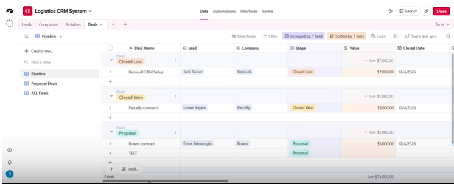
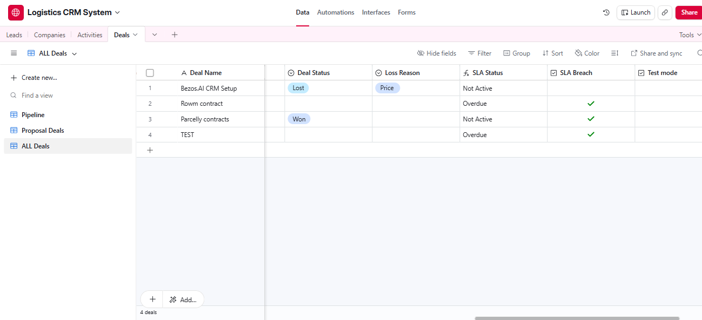
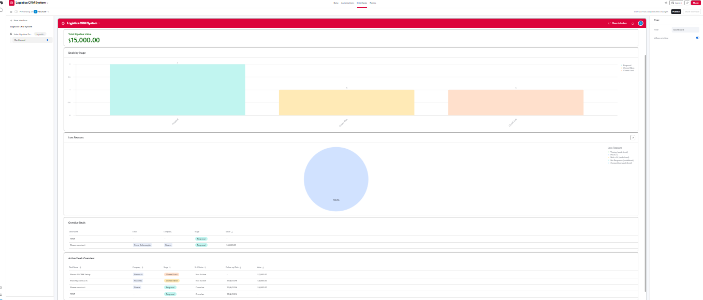
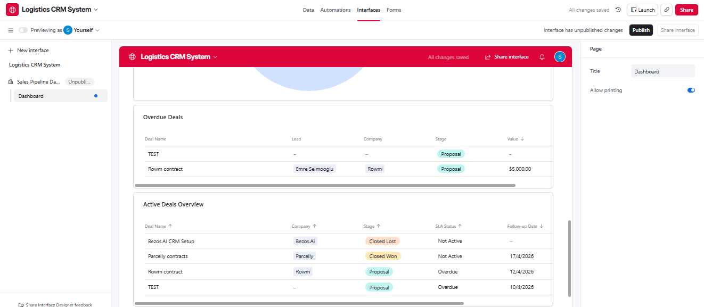
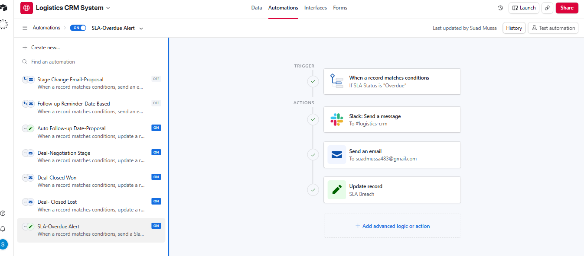
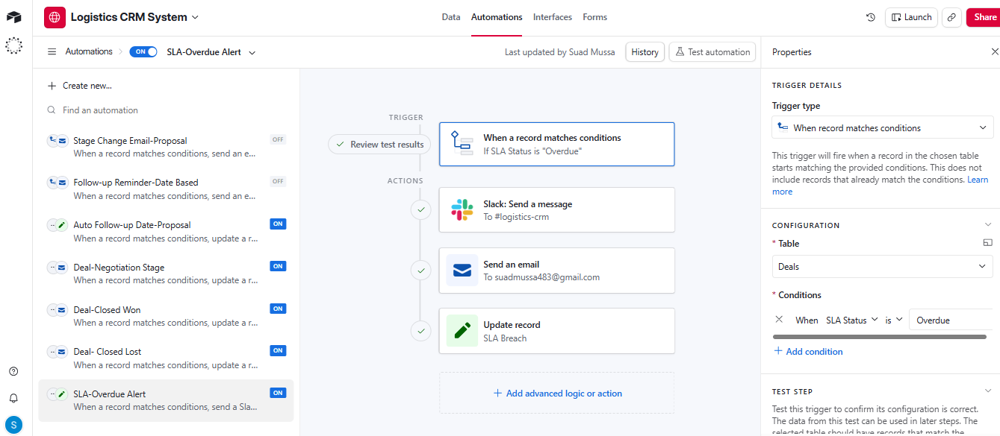

# End-to-End CRM System with Automation & SLA Tracking (Airtable + Salesforce)

## Overview
This project is a fully functional CRM system designed to simulate a real-world B2B sales pipeline.

It was built to eliminate manual tracking, improve pipeline visibility, and ensure no revenue opportunities are missed through structured data and automation.

---

## Key Features

- Lead, company, and deal tracking with relational data structure
- Clear pipeline stages reflecting a real sales process
- Automated follow-ups triggered by deal stage changes
- SLA tracking to identify and flag overdue deals
- Dashboard for pipeline visibility and performance monitoring

---

## What This Solves

Many businesses rely on spreadsheets or inconsistent systems, which leads to:

- Lost or untracked leads
- Missed follow-ups
- Lack of visibility on deal progress

This system solves that by introducing a structured, automated CRM workflow that keeps everything organised and actionable.

---

## Tools Used

- Airtable (CRM build + automation logic)
- Salesforce (workflow + automation practice)
- Google Sheets (data cleaning and structuring)

---

## Demo

Watch the full walkthrough here:
👉 https://www.loom.com/share/2954033ba1be4f2383c3252988b2981d

---

## Screenshots

### Pipeline View

### Deals Table

### Dashboard

### Dashboard Detailed

### Automation Example

### Automation Config

## Outcome

This project demonstrates the ability to:

- Design and structure CRM systems
- Model relational data effectively
- Build automation workflows to reduce manual work
- Track SLAs and prioritise pipeline activity
- Improve operational efficiency and visibility
